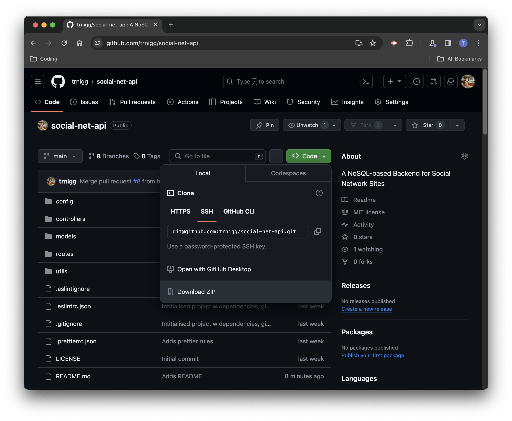

# social-net-api

(`social-net-api` - Module 18 Challenge)

A basic NoSQL backend for social network sites.

## Description

- This project is a simple API for a social network application where users can share their thoughts, react to friends’ thoughts, and create a friend list.
- It is written in JS using the [`Node.js`](https://nodejs.org/en) runtime environment, and built on a a MongoDB database, leveraging [`Express.js`](https://www.npmjs.com/package/express/v/4.18.2) for routing, and using the [`Mongoose`](https://www.npmjs.com/package/mongoose/v/8.0.3) ODM.
  - Additionally, [`date-fns`](https://www.npmjs.com/package/date-fns/v/3.1.0) assists with formatting time-stamps.
- The use-case of this app would be to incorporate it with a suitable front-end. However, to install and test functionality, please follow the [installation](#installation) and [usage](#usage--demo) guides below.

## Table of Contents

- [Description](#description)
- [Installation](#installation)
- [Usage / Demo](#usage--demo)
  - [Usage](#usage)
  - [Demo Video](#demo-video)
- [Tests](#tests)
- [Roadmap / Known Bugs](#roadmap--known-bugs)
- [License](#license)
- [Questions](#questions)

## Installation

> [!IMPORTANT]
> Before installing the application, please ensure you have installed [`Node.js`](https://nodejs.org/en) and `npm`.  
> Additionally, [`MongoDB`](https://www.mongodb.com/) is required to initialise and work with the database in your local environment.

To install the application:

1. Visit the [social-net-api](https://github.com/trnigg/social-net-api) repo on GitHub.
2. Download and extract the `.zip` of the repository to your desired directory:  
   
3. Navigate to the directory using the console, or open it in an integrated terminal.
4. Enter `npm i` or `npm install` in your console or integrated terminal to retrieve and install the required dependencies and automatically create a folder to store these (`./node_modules`).

## Usage / Demo

### Usage

> [!NOTE]
> To test the API functionality, please be aware that you will need an API tool such as [Insomnia](https://insomnia.rest/).

1. While in the directory the project-files are stored in (see [Installation](#installation) above), enter `npm run start` in the console to start the local server.
2. With the server up and running, a number of calls can be made using your API client of choice. Please see the demo video below for examples of all the available requests.

### Demo Video

Click on the thumbnail below for a detailed demo of the back-end capabilities.  
Please note, the demo includes the installation process. To skip this, and see only the routes being tested, go to 1:15 in the video.

## Tests

No tests have been written for this application.

## Roadmap / Known Bugs

Curently, there are no known bugs or [issues](https://github.com/trnigg/social-net-api/issues).

With more dev time in the future, there are a few additions required to the API/db-model before it can be used for something like a social-media site. These include:

- Password fields for users and password hashing.
- An improved system for adding friends bilaterelly, potentially uusing a "pending_friends" field or similiar.
- More validations and data-checks - for example, a user should ideally only be able to add a friends that the API/db recognises as a registered/valid user.

## License / Credits

This project is licensed under the [MIT License](https://choosealicense.com/licenses/mit).  
Please refer to the [license](./LICENSE) section in the repo for further information.

## Questions

For any questions, [issues](https://github.com/trnigg/social-net-api/issues) or feedback, please reach out to me on GitHub at [trnigg](https://github.com/trnigg/).
